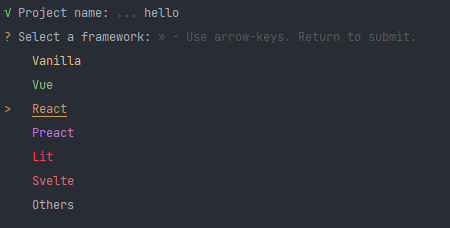
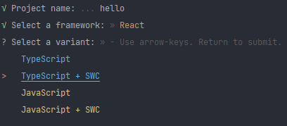

# readme

## Création du projet
 
````bash
npm create vite
````

Nom du projet


Sélection du framework




Swc (Super-fast Web Compiler) est un compilateur Js/Ts utilisé côté serveur pour compiler du code très rapidement.



````bash
npm install
````

## Installation de prettier avec eslint

````bash
npm install prettier eslint-config-prettier eslint-plugin-prettier --save-dev
````

Ajouter le fichier **.prettierrc.cjs** à la racine du projet

````flow js
module.exports = {
    semi: false,
    trailingComma: 'none',
    singleQuote: true,
    printWidth: 120,
    tabWidth: 2,
};
````

Ajouter le fichier **.prettierignore** afin d'y renseigner les fichiers à ne pas scanner

Les différentes options pour configurer le fichier **.prettierrc.cjs** :
https://prettier.io/docs/en/options.html

Dans la section **scripts** du **package.json**, ajouter

````bash
"format": "prettier --write ."
````

Dans le fichier **.eslintrc.cjs** ajouter dans la section **extends**
````
 'plugin:prettier/recommended',
````

et dans les **plugins**

````
'prettier'
````

````flow js
module.exports = {
  env: { browser: true, es2020: true },
  extends: [
    'eslint:recommended',
    'plugin:@typescript-eslint/recommended',
    'plugin:react-hooks/recommended',
    'plugin:prettier/recommended',
  ],
  parser: '@typescript-eslint/parser',
  parserOptions: { ecmaVersion: 'latest', sourceType: 'module' },
  plugins: ['react-refresh', 'prettier'],
  rules: {
    'react-refresh/only-export-components': 'warn',
  },
}
````

## Gitlab CI/CD